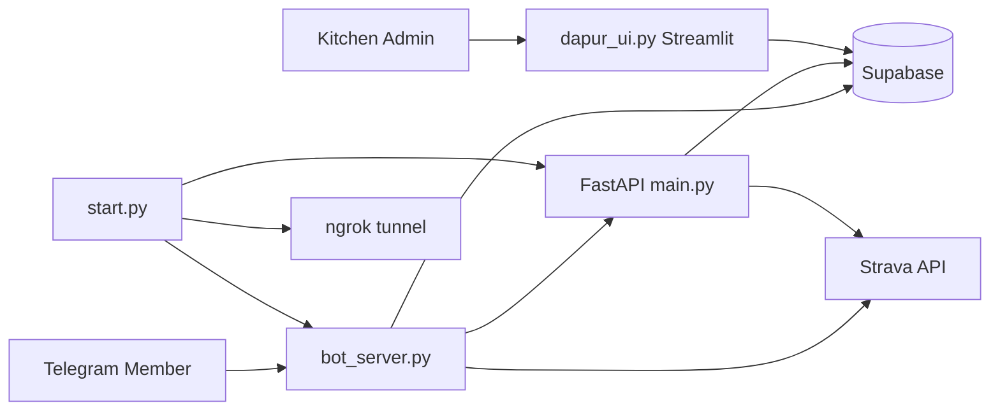

# GastroHUB — Smart Healthy Catering

Platform catering sehat berbasis **Telegram Bot + Kitchen Dashboard + Supabase**, dengan personalisasi menu recovery berdasarkan aktivitas olahraga (Strava / input manual), berat badan, dan goal nutrisi member.

> Portfolio project — full-stack automation untuk operasional dapur catering harian (WITA).

---

## Highlights

- **Multi-member Telegram bot** — registrasi, profil, order harian, integrasi Strava OAuth
- **Personalized recovery menu** — scaling kalori, porsi, dan harga otomatis per member
- **Master menu harian** — 7 hari × 3 menu dari Supabase (seed dari Excel)
- **Operasional dapur (WITA)** — jam buka/tutup order, 4 batch pengiriman (09:00 / 12:00 / 15:00 / 18:00)
- **Mode libur & sold out** — kontrol admin via dashboard
- **Kitchen dashboard (Streamlit)** — antrian order, kelola member, analitik nutrisi

---

## Architecture



---

## Tech Stack

| Layer | Technology |
|-------|------------|
| Bot | Python, pyTelegramBotAPI |
| API | FastAPI, Uvicorn |
| Dashboard | Streamlit, Altair, Pandas |
| Database | Supabase (PostgreSQL) |
| Integrations | Strava OAuth, Telegram Bot API |
| Dev tunnel | pyngrok |

---

## Project Structure

```
├── bot_server.py          # Telegram bot 24/7 (member-facing)
├── main.py                # FastAPI backend (orders, Strava callback)
├── dapur_ui.py            # Streamlit kitchen dashboard
├── start.py               # Orchestrator: ngrok + API + bot
├── menu_service.py        # Fetch menu harian + sold out
├── operating_hours.py     # Jam operasional & batch pengiriman WITA
├── holiday_service.py     # Mode libur global
├── agent.py               # Prototype single-user (legacy)
├── scripts/
│   ├── seed_menus_from_excel.py
│   └── review_menu_excel.py
├── data/
│   └── gastrohub_menu_update.xlsx
├── requirements.txt
└── .env.example
```

---

## Getting Started

### 1. Clone & install

```bash
git clone https://github.com/23krsz/sassyroll-catering.git
cd sassyroll-catering
python -m venv venv
venv\Scripts\activate        # Windows
pip install -r requirements.txt
```

### 2. Environment

Copy `.env.example` → `.env` dan isi semua variabel.

```bash
copy .env.example .env
```

Generate hash password dashboard:

```python
import hashlib
print(hashlib.sha256("password-dapur-kamu".encode()).hexdigest())
```

### 3. Supabase setup

1. Buat project di [supabase.com](https://supabase.com)
2. Jalankan migration menu (tabel `menu_days`, `menu_templates`, `menu_template_items`, `menu_availability`, `system_settings`)
3. Seed menu dari Excel:

```bash
python scripts/seed_menus_from_excel.py
```

### 4. Run

**Semua service sekaligus:**

```bash
python start.py --ngrok-token YOUR_NGROK_TOKEN
```

**Dashboard dapur:**

```bash
streamlit run dapur_ui.py
```

- Bot: Telegram
- API docs: http://localhost:8000/docs
- Dashboard: http://localhost:8501

---

## Business Rules (WITA)

| Jam order | Batch pengiriman |
|-----------|------------------|
| 06:00 – 09:00 | 09:00 |
| 09:01 – 12:00 | 12:00 |
| 12:01 – 15:00 | 15:00 |
| 15:01 – 18:00 | 18:00 |

Order di luar 06:00–18:00 WITA ditolak otomatis.

---

## Security Notes

- **Jangan commit `.env`** — sudah di `.gitignore`
- Gunakan `SUPABASE_SERVICE_KEY` hanya di backend/dashboard server-side
- `INTERNAL_API_KEY` melindungi endpoint order API
- Rotate token jika pernah ter-expose

---

## Author

**Krisna Bhagawanta** — [GitHub @23krsz](https://github.com/23krsz)

---

## License

Private portfolio project. Contact author for usage permissions.
